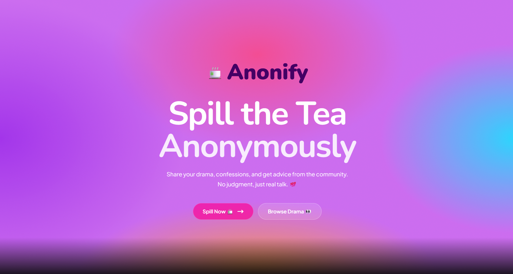
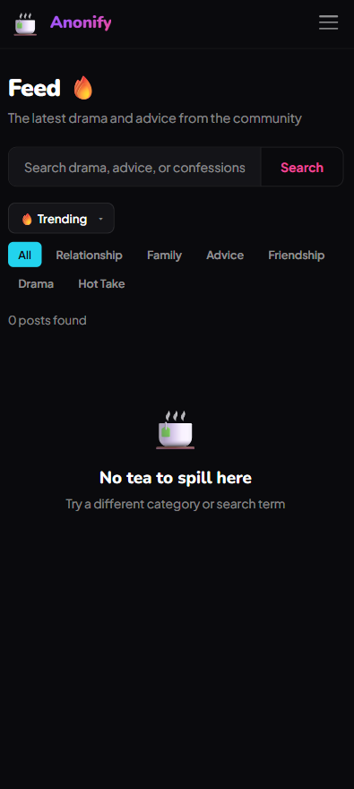

# ☕ Anonify

Anonify is a full-stack anonymous social platform built using the MERN stack.
It allows users to share stories, confessions, and opinions anonymously while maintaining secure authentication and structured community interaction.

🌐 **Live Demo**

https://anonify-v2.vercel.app/

---
## 📌Features

- Anonymous post creation
- Community feed with dynamic rendering
- Post reactions and comments
- Category-based filtering (Advice, Drama, Relationship, etc.)
- Secure authentication (JWT-based)
- Password hashing using bcrypt
- Structured backend validation and centralized error handling
- RESTful API architecture
- Human-readable timestamps
- Responsive design

---
## 📌 Version

v2.0.0 – MERN Rebuild

---
## 📸 Screenshots  

  
  

